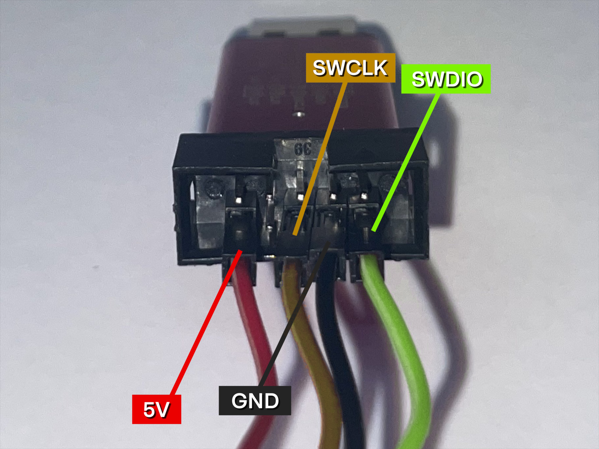

# Ninebot G2 ESC ST-Link

### Table of Contents

- [Preface](#preface)
- [Warning](#warning)
- [Dissasembling](#dissasembling)
  - [Full dissasembling](#full-dissasembling)
  - [Drilling](#drilling)
- [Flashing-proccess](#flashing-process)
  - [Debug-layout](#debug-layout)
  - [Flashing](#flashing)
- [Firmware](#firmware)
  - [XiaoDash](#xiaodash)
- [Thank You!](#thank-you)

---

### Preface

In this guide we will talk about how to ST-Link your Ninebot G2 ESC. We will find out where the debug-pins/electricity-pins are, how we reach them, and which provider we can use to flash 3rd-part-firmware.

### Warning
Make sure to always drain your capacitors when working with your ESC. You want to do this to prevent shorts. **Step-by-step**: Plug out battery cable, leave all else cables plugged in, now turn on the scooter and wait until it turns off itself.

---

### Dissasembling

We have two methods for this process, each requires different tools:
- [Full dissasembling](#full-dissasembling)
- [Drilling](#drilling)

#### Full dissasembling

For the G2 ESC, there are many factors that make it difficult to reach the debug points. If you plan on making multiple mods to your ESC, then you should probably prefer this method. However, it won't be easy, you will need a lot of strength and patience. Be aware of this.

Step-by-step: 

**1. Dissasemble mosfet-clamp**

What you need:
- Flathead-screwdriver
- Vice/Screw-clamp

Place the screwdriver on the mosfet-clamp from the right side. Gently hammer the end of the screwdriver and see how the mosfet-clamp slowly moves to the side with each hit. Example video <a href="https://imgur.com/a/qNCjqaL">here</a>.

**2. Getting the PCB out of the frame**

What you need:

- Can (Full one)
- Hammer

Place the right side of the PCB vertically on the edge of the can and start hammering on the upper case of the ESC. This will put pressure on the PCB, which will slowly loosen the glue responsible for holding it in place. I know it seems like nothing happens, but trust me, if you create enough force, the PCB will jump a little out of the frame after time. At this point you can just pull it out by your hands. Example video <a href="https://imgur.com/a/8d38ukp">here</a>.

---

#### Drilling

If this all sounds too much for you, you may consider drilling a hole through the case to reach the debug-points. This can be easily done with a normal driller-tip. Please don't forget to put something rubbust between the PCB and the case so that the PCB is protected from damage. An old ram stick is perfect for this. The dimensions for the hole are shown below.

---

### Flashing-process

If you've made it this far:  Congratulations! The hardest part is done now.

#### Debug-layout

 

Please connect 5V and GND before you plug the ST-Link into your smartphone, otherwise you may short-circuit your PCB. SWDIO and SWCLK doesn't matter, they don't have very high voltage or current. If you have unmodified cables, the female cables will most likely be loose on the ESC-pins. You want to use tape to hold the connectors in place.

#### Flashing

What you need:

- <a href="https://www.amazon.de/Programmiereinheit-Emulator-Downloader-unterst%C3%BCtzt-Herunterladen/dp/B09TSGY9HS/ref=asc_df_B09TSGY9HS/?tag=googshopde-21&linkCode=df0&hvadid=676878220516&hvpos=&hvnetw=g&hvrand=17686283841252475333&hvpone=&hvptwo=&hvqmt=&hvdev=c&hvdvcmdl=&hvlocint=&hvlocphy=9044460&hvtargid=pla-1659480933755&psc=1&mcid=6ecf48aa810b389dba49250c4e64c143&th=1&psc=1">ST-Link v2</a>
- <a href="https://www.amazon.de/Female-Female-Male-Female-Male-Male-Steckbr%C3%BCcken-Drahtbr%C3%BCcken-bunt/dp/B01EV70C78/ref=sr_1_5?keywords=jumper+male+cable&qid=1702332627&sr=8-5">Jumper-male cables</a>

- <a href="https://www.conrad.de/de/p/motorola-moto-e13-smartphone-64-gb-16-6-cm-6-52-zoll-schwarz-android-13-dual-sim-2798428.html?hk=SEM&WT.mc_id=google_pla&gad_source=1&gclid=CjwKCAiAg9urBhB_EiwAgw88mbdcDYutrtnl49KUKlPQEGOYdK0SP5y46G7Mrpov3Cq90uQVXm5fUBoCwCcQAvD_BwE&refresh=true">Android-Smartphone</a>

- <a href="https://www.ebay.de/itm/115319785226?chn=ps&_ul=DE&_trkparms=ispr%3D1&amdata=enc%3A17T2SU-viRKWpoM3NtzlsPQ52&norover=1&mkevt=1&mkrid=707-134425-41852-0&mkcid=2&mkscid=101&itemid=115319785226&targetid=1716911581919&device=c&mktype=pla&googleloc=9044460&poi=&campaignid=17943303986&mkgroupid=140642150118&rlsatarget=pla-1716911581919&abcId=9301060&merchantid=494547460&gclid=CjwKCAiAg9urBhB_EiwAgw88mdq0WZeXU5NVyY6s54l7l0te7RXJ1KIycyPAX9uf75ledy23oKCA1hoCJeAQAvD_BwE">OTG-Adapter (USB-C to USB-Female)</a>

**1. Connecting**

**2. Flashing 3rd-party-firmware**

At the current status (December 11, 2023), the only way of speedhacking your ESC, is with XiaoDash. A return to stock firmware is not possible. This means once the controller has flashed XDFW (XiaoDash firmware), the license MUST be purchased, otherwise the dashboard will display a permanent error code. 

I will update this guide as soon as ScooterHackingUtility supports the G2 as well.

---

### XiaoDash

What you need:

- <a href="https://www.xiaodash.app/buy">50€ 
(License)</a>
- <a href="https://www.xiaodash.app/">XiaoDash</a>

**1. Open the app and click on "Offline mode"**

**2. Click on "Basic" tab**

**3. Open "Stlink Utility"**

**4. Select "G2 Controller"**

**5. Press "Start Stlink"**

Give XiaoDash the permisson to use your ST-link. Now a 10-seconds countdown will start, in those 10-seconds, you have time to attach the SWDIO-wire, and SWCLK-wire, to their designated fields. No need to rush, the timer will start again if the flash was unsuccessful.

If your flash was successful, XiaoDash show up this message:

Now just do what the message tells you to.

**6. Purchase license**

If you have now connected your ESC to the dashboard, the error code "E3" will be shown on the display. This happens because the firmware flashed onto your scooter is unlicensed. To get around this, you can now buy the XiaoDash license using the "Expand your scooter's functionality" button. Now you can successfully use your scooter via 3rd-party-firmware.

---

### Thank you!

If you've read this far, then you should now know how to flash 3rd-party-firmware on to your G2 ESC. I would like to thank both services, ScooterHackingUtility, aswell as XiaoDash, for offering such great firmware! 

This guide was written from (11/12/2023) to (16/12/2023), and took a lot of effort. If you appreciate my work, a <a href="https://www.paypal.com/donate/?hosted_button_id=JXSMGF7S8TG3Y">donation</a> would be greatly appreciated.